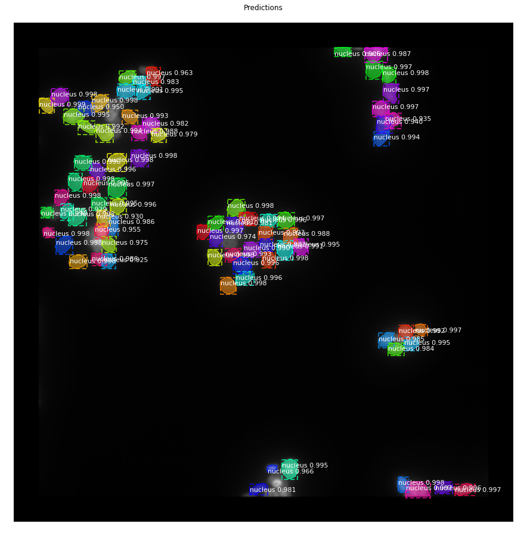
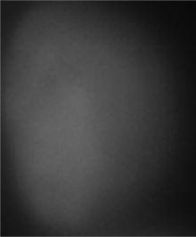
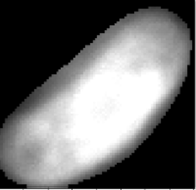

# NDAcquisition

* This is one of my research now in Saito Lab. It can be divided by almost 2 steps. One is to split each cell and save as one cell image, the other is to classify with two classes that the cell is healthy or ill.

* The data is not provided in public, the data sample is like as following.

  * This is a sample of the research data. This is a piece of Z-stack telescope data that make by Collaborator 光山先生.

   

  

  * The First STEP of the research is to split each Cell from the whole image. And the following image is some sample of results that pick by the boxes and masks which are gotten from segmentation information.

 

 
